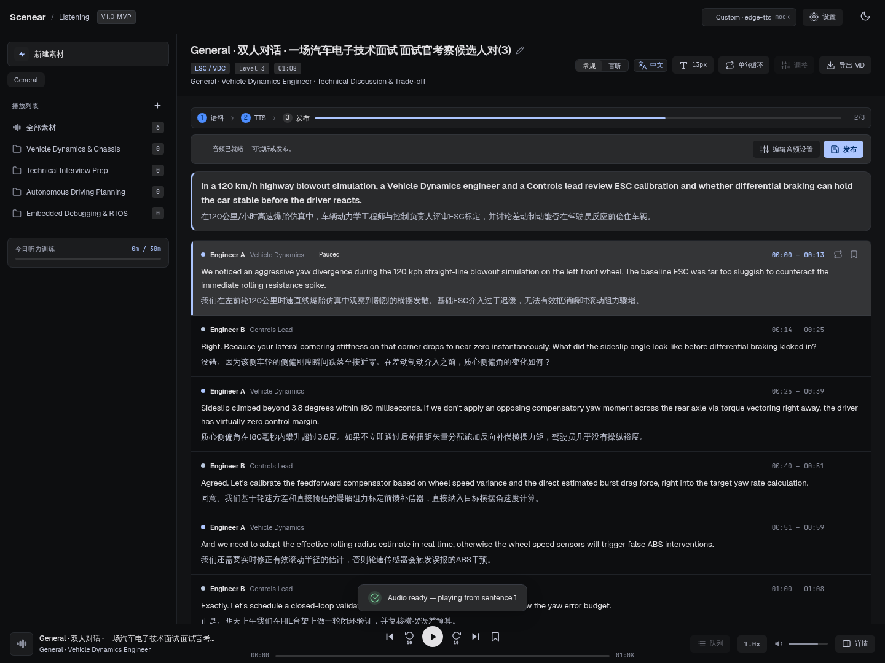
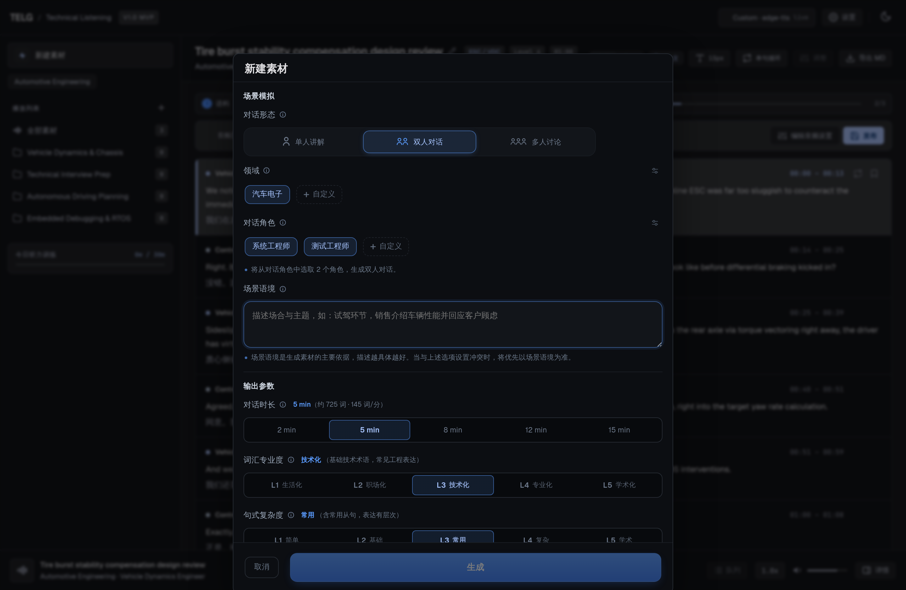
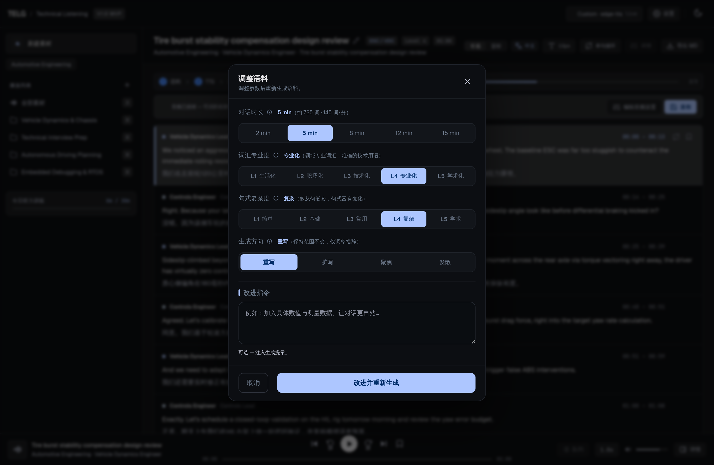
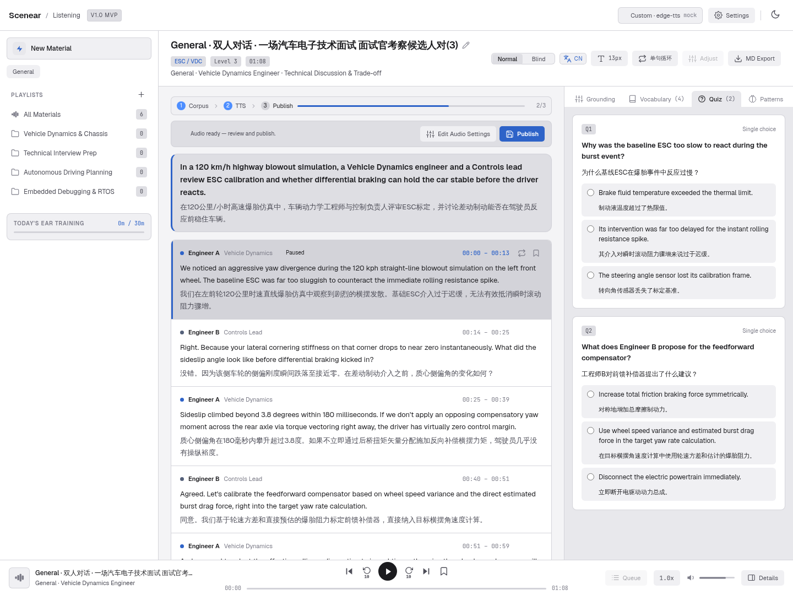

# Scenear场景听

> **Crafted for your ears. Scenes that resonate.**
> **为耳朵定制，让场景掷地有声。**

想在真实场景里练习听力，但没有英语环境？想边听材料边学习专业知识，但没有合适的英语教练？
从今天开始不一样了，**使用Scenear场景听，你只需要来描述想要的场景，然后就能进入沉浸式场景来听了。**
再也不是刻板老旧的教材了，再也不用泛泛而听了。每个场景都是为您量身定做的，兼顾生活化和术语专业度。这些场景是你明天要面的试、要开的会、要谈的客户...任您选择~

---
## 目录

- [这是什么](#这是什么)
- [为谁而做](#为谁而做)
- [它和别的工具哪里不一样](#它和别的工具哪里不一样)
- [怎么用](#怎么用)
- [一个完整的例子](#一个完整的例子)
- [界面预览](#界面预览)
- [核心能力](#核心能力)
- [当前状态](#当前状态)
- [技术](#技术)
- [路线图](#路线图)
- [关于](#关于)

---
## 这是什么

Scenear 是一个**场景化听力素材生成器**。
你描述一个你真正会遇到的场景——一次英文技术评审、一场面试、一次客户沟通、一段学生讨论。Scenear 根据你描述的场景，生成一套完整的听力素材：

- 双语对话（英文 + 中文对照，逐句对齐）
- 场景背景（领域背景、核心原理、发生场合）
- 重点词汇（术语 + 标准译法 + 释义）
- 听力理解题（含中文对照）
- 可迁移句型（模板 + 例句）
- 配套音频（按角色分音色，真人语音）

一次生成，直接可以听、可以读、可以练。



---
## 为谁而做

**准备英文面试的人。** 不用再找通用的面试模板，直接生成你目标岗位、目标领域、目标风格的面试对话。

**需要开英文会议的职场人。** 明天有一个跨部门评审会？生成一段类似的对话先熟悉一下。

**想积累专业英语的人。** 每个领域的术语、表达、讨论方式都不一样。围绕自己的领域生成素材，比听泛英语有效得多。

**任何想通过真实场景提升听力的人。** 技术只是 Scenear 支持的领域之一，不是默认。职场、学生、商务、学术——都可以是素材的来源。

---
## 它和别的工具哪里不一样

### 场景是核心，不是主题

大多数听力工具让你"选一个主题"。Scenear 让你**描述一个场景**。

你可以指定对话形态、练习领域、参与角色、对话时长，还有场景语境——这些会一起成为生成的约束，让内容更贴近你真实要用到的环境。场景语境优先级最高：与其他设置冲突时，以语境为准。

### 难度拆成两个独立的轴

其他工具一般只有一个难度分级。但"专业"和"复杂"其实是两件事。

Scenear 把语言难度拆开：

**词汇专业度（L1–L5）** —— 从生活化的聊天用词，到专业技术、学术讨论。
**句式复杂度（L1–L5）** —— 从简单直接的短句，到复杂的长句、从句、自然的口语表达。

两个轴可以自由组合：

| 组合 | 适合 |
|---|---|
| 专业词汇 + 简单句式 | 刚进入某领域，术语能听懂，句子不绕 |
| 日常词汇 + 复杂句式 | 专门练复杂句法，词汇不成为障碍 |
| 专业词汇 + 复杂句式 | 高水平训练，模拟真实专业场景 |
| 日常词汇 + 简单句式 | 日常对话，轻松上手 |

你可以精确控制自己练什么，而不是被工具的固定分级绑住。

### 一次生成一整套，不是一段文字

生成的不是一篇文章，而是一整套围绕同一场景的学习素材：

**对话 → 背景 → 词汇 → 听力题 → 句型 → 音频**

直接进入学习，不用再去拼。

### 可以继续改

生成完不满意？不用重新来。可以继续调整：

- **重写** —— 结构不动，换种说法
- **扩写** —— 补充更多细节与论证
- **聚焦** —— 收敛到某一个点深入展开
- **发散** —— 从不同立场/角度重新组织
- **自定义** —— 直接说你想怎么改

一次生成不是终点，是一个可以不断打磨的起点。

### 播放器是学习场景，不是播放控件

- 中英对照，逐句对齐，翻译一键显隐
- 逐句高亮，跟读方便
- 单句循环、倍速，反复听
- 角色分音色，像在听真实对话
- **盲听模式**：文本模糊，先听后看，训练真实听辨
- 收藏、素材库，随时回来再练

每句对话既是听力内容，也是一个独立的学习单元。

---
## 怎么用

```
① 描述场景
       ↓
② 设置难度（词汇专业度 + 句式复杂度）与时长
       ↓
③ 生成素材（对话 · 背景 · 词汇 · 听力题 · 句型 · 音频）
       ↓
④ 听 / 读 / 练
       ↓
⑤ 收藏 / 精调（重写 · 扩写 · 聚焦 · 发散）
       ↓
⑥ 下次再打开
```

从描述到听到，几分钟。

---
## 一个完整的例子

假设你要准备一次英文技术面试。

**你告诉 Scenear：**

> 生成一段汽车底盘控制算法工程师的英文技术面试。面试官问候选人怎么设计爆胎稳定性控制策略，要求讨论车辆动力学、横摆稳定性和扭矩分配。

**你设置：**

- 形态：双人对话
- 领域：汽车电子
- 词汇专业度：L4 专业化
- 句式复杂度：L3 常用
- 时长：8 分钟

**Scenear 给你：**

- 面试官和候选人的完整对话，两人对等交流
- 背景说明：爆胎稳定性控制的技术原理和典型应用场景
- 词汇表：yaw moment、differential braking、lateral acceleration……
- 听力题：问候选人提到了哪几个关键约束
- 句型：面试中常用的追问和澄清表达
- 音频：面试官和候选人两个不同音色

**你练的，不是一段和自己无关的英语。**
**是你下个月真的会走进的那场面试。**

---
## 界面预览

| 新建素材：描述场景 · 设置双轴难度 | 调整语料：按需精调 |
|---|---|
|  |  |

| 学习主界面（暗色 · 中文） | 测验与翻译（亮色 · English） |
|---|---|
|  |  |

---
## 核心能力

| 能力 | 说明 |
|---|---|
| **场景化生成** | 描述场景，生成完整素材（对话 + 背景 + 词汇 + 听力题 + 句型 + 音频） |
| **难度双轴** | 词汇专业度与句式复杂度独立控制（L1–L5） |
| **多形态支持** | 单人讲解 / 双人对话 / 多人讨论（3–5 人，按语境从候选池选角） |
| **多领域支持** | 技术、职场、学生、商务、学术……支持自定义领域与角色 |
| **语料精调（refine）** | 重写 / 扩写 / 聚焦 / 发散 + 自由改进指令 |
| **沉浸式播放** | 中英对照、逐句高亮、盲听模式、单句循环、倍速 |
| **制作流水线** | 语料 → TTS（按角色分音色）→ 发布，全流程可视 |
| **素材管理** | 素材库、播放列表、收藏、学习统计、Markdown 导出 |

---
## 当前状态

Scenear 持续开发中，核心链路已经跑通：

**生成 → 播放 → 收藏 → 素材库** ✅

已完成：首启引导与学习档案（问卷 → LLM 生成画像 + 领域/角色/场景推荐）、语料精调 refine、真实 TTS 合成（edge-tts 在线 / Kokoro 本地离线）、中英双语界面与暗色模式、LLM Prompt 链路 v2.x 系统性优化（结构化 Schema + 分区重试 + 非阻断校验）。

正在完善：异步任务队列、更多 TTS 音色定制、个性化推荐增强。

---
## 技术

当前版本使用：

| 层 | 方案 |
|---|---|
| 前端 | 原生 HTML / CSS / JavaScript（单文件，无构建步骤） |
| 后端 | Python · FastAPI · SQLite |
| LLM | OpenAI 兼容 SDK（DeepSeek / 豆包 / Kimi / OpenAI / Qwen / Ollama…） |
| TTS | edge-tts（在线）· Kokoro（本地离线）· ffmpeg 拼接 |
| 测试 | Playwright e2e（全链路回归 / TTS 角色 / 边缘场景） |

API Key 由后端持有，前端不直接接触。LLM Prompt 链路设计见 [`docs/设计/design-prompt链路设计说明书.md`](docs/设计/design-prompt链路设计说明书.md)。

### 快速开始

```bash
# 环境要求：Python 3.10+，ffmpeg
cd backend
pip install -r requirements.txt
python main.py                # 启动后端（默认 http://127.0.0.1:8000）
```

浏览器打开 **http://127.0.0.1:8000**（后端同源托管前端，请勿用 `file://` 直接打开）。

首次使用在「设置 → LLM」配置 API Key（OpenAI 兼容，支持 Custom 手动填 Base URL / Model / Key），**Test Connection** 验证后 **Apply Settings** 生效。也支持环境变量：`TELG_LLM_BASE`、`TELG_LLM_API_KEY`（兼容别名 `DEEPSEEK_API_KEY`）、`TELG_LLM_MODEL`。

无 Key / 无网络时，打开「设置 → 开发者模式」的 LLM Mock / TTS Mock 即可用固定数据集走通全流程演示。

运行 e2e 回归（可选，需额外安装 Playwright 与浏览器内核）：

```bash
pip install playwright
playwright install chromium
python tests/e2e/test_flow_e2e.py        # 全链路回归（需先启动后端）
python tests/e2e/test_tts_roles_e2e.py  # TTS 角色分配
python tests/e2e/test_edge_e2e.py       # 边缘场景
```

完整运行指南（Windows / macOS / Linux 适配、验证清单、常见问题）见 [`docs/运维/running-guide-运行指南.md`](docs/运维/running-guide-运行指南.md)。

---
## 路线图

- [x] 场景化生成（对话 + 背景 + 词汇 + 听力题 + 句型）
- [x] 双语对话 + 音频（TTS 按角色分音色）
- [x] 沉浸式播放器（盲听 / 逐句高亮 / 单句循环 / 倍速）
- [x] 语料精调 refine（重写 / 扩写 / 聚焦 / 发散 + 改进指令）
- [x] 学习档案与推荐配置（LLM 生成画像 + 领域/角色/场景推荐）
- [x] LLM Prompt 链路 v2.x（结构化 Schema · 分区重试 · 非阻断校验）
- [ ] 异步任务队列（生成进度服务端驱动）
- [ ] 更多 TTS 引擎与音色自定义
- [ ] 个性化推荐增强
- [ ] 桌面端 / 移动端

---
## 关于

Scenear 是一个正在开发中的产品。
我们相信，最好的语言学习素材不是别人替你选的，而是你自己描述的。

> 从"找素材"变成"描述我想面对的场景，然后开始练习。"

---
## License

License 待定。
